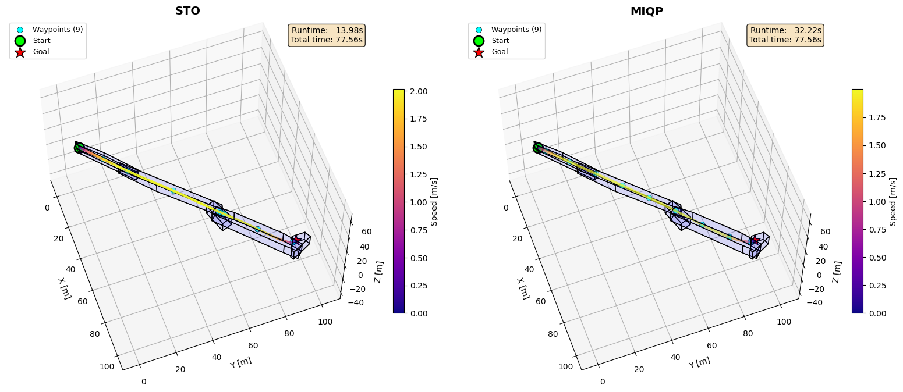
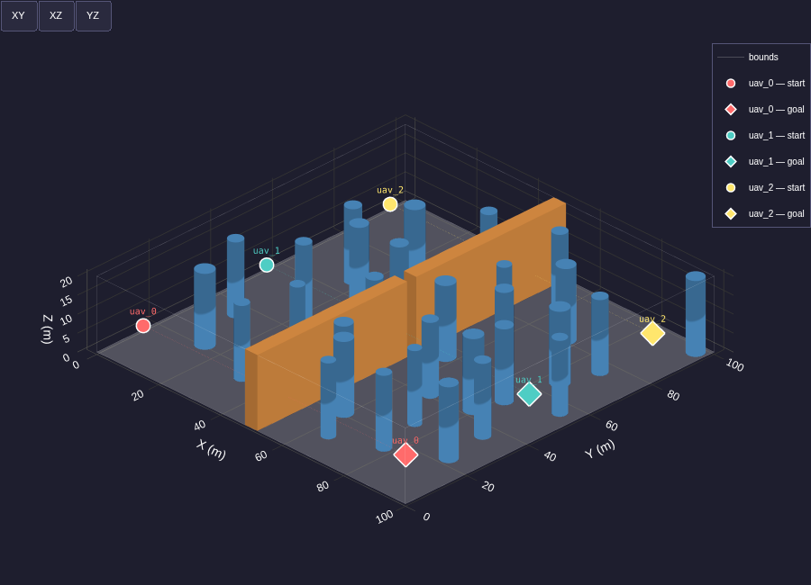
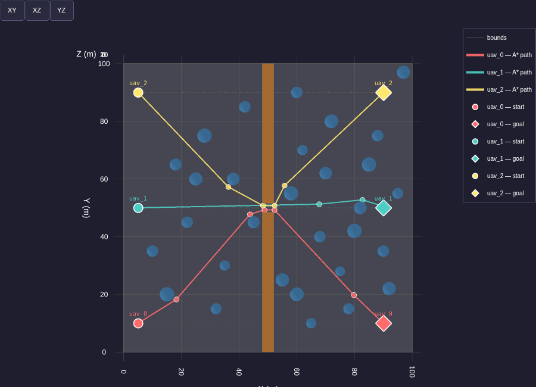
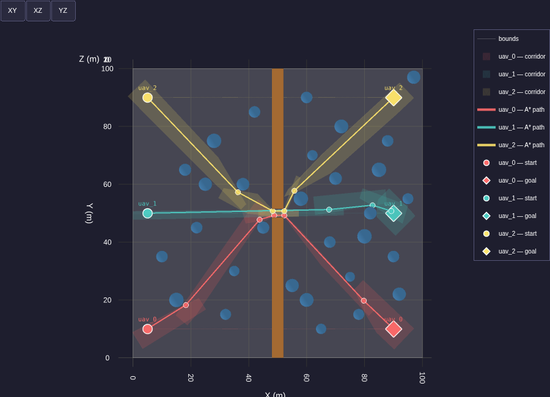
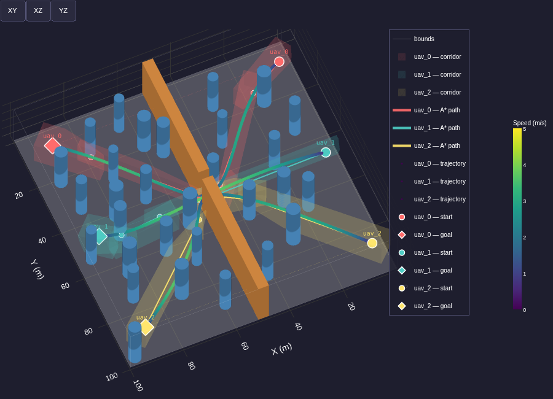
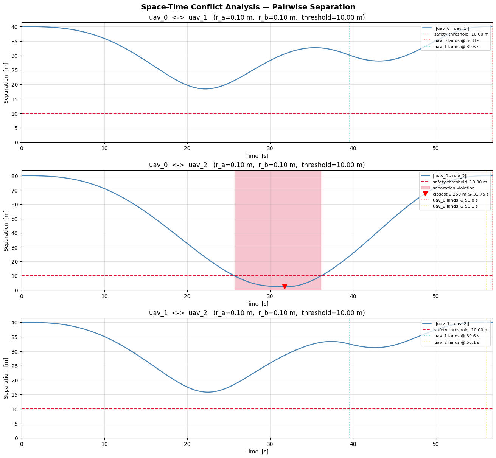
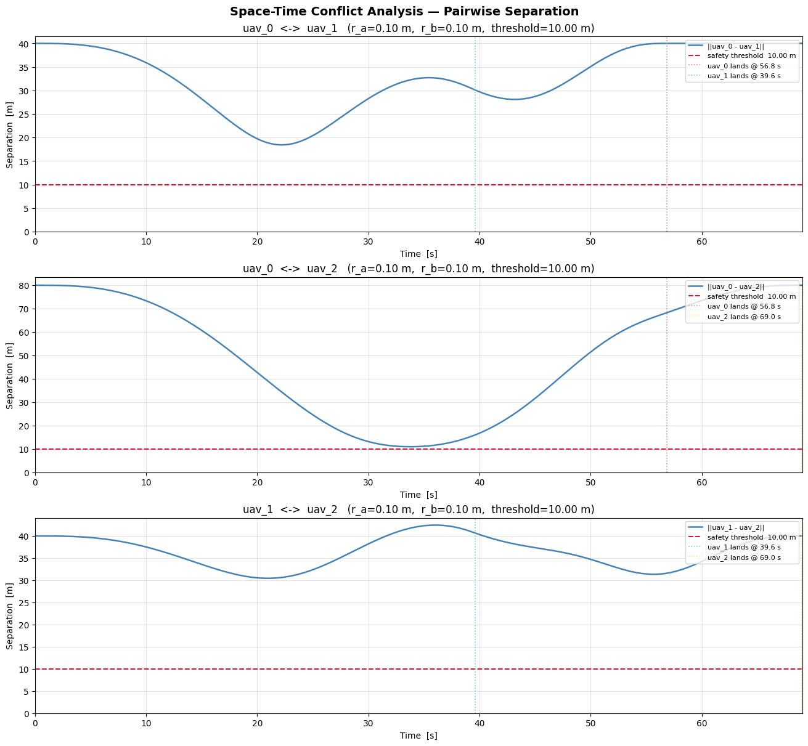

# UAV Safe Planning — Semester Thesis

<div align="center">

**Technical University of Munich (TUM)**  
Autonomous Aerial Systems Lab · Chair of Information-oriented Control (ITR)

[](docs/Semester_Thesis.pdf)
[](https://www.python.org/)
[](https://pytorch.org/)
[](https://plotly.com/)

</div>

---

## Overview

This repository contains the implementation developed for the **Semester Thesis** at the
[Autonomous Aerial Systems Lab](https://www.ce.cit.tum.de/itr/home/), TUM.
The work focuses on **safe trajectory planning for a fleet of UAVs** operating in
cluttered, shared 3-D environments.

Two tightly coupled planning layers are developed and integrated:

| Module | Description |
|---|---|
| **STO** (Spatio-Temporal Optimizer) | Gradient-based single-UAV trajectory optimizer using MINCO (5th-order polynomial) representation and L-BFGS |
| **Swarm Planner** | Multi-UAV pipeline: A\* global planning → convex safe corridor generation → STO optimization → space-time conflict detection & replanning |

📄 **Full thesis:** [docs/Semester_Thesis.pdf](docs/Semester_Thesis.pdf)

---

## Demos

### Swarm Simulation — Initial Planning

<div align="center">

</div>

### Swarm Simulation — After Conflict Resolution

<div align="center">

</div>

---

## Results

### STO vs. MIQP Trajectory Comparison

<div align="center">


</div>

<div align="center">


</div>

### Swarm Planning Pipeline

<div align="center">



</div>

<div align="center">


</div>

<div align="center">

</div>

---

## Repository Structure

```
uavsafeplanning/
├── STO/
│   ├── STO.ipynb                  # Single-UAV STO demo & benchmarks
│   └── sto_planner.py             # Core STO optimizer (L-BFGS + MINCO)
│
├── SWARM/
│   ├── SwarmPlanning.ipynb        # Full swarm planning demo notebook
│   ├── SingleUAV.ipynb            # Single UAV within swarm context
│   ├── environment.py             # 3-D voxel environment (cylinders + walls)
│   ├── global_planner.py          # A* path planner (6 / 18 / 26-connectivity)
│   ├── safe_corridor.py           # Convex safe corridor generation
│   ├── conflict_detector.py       # Space-time conflict detection (proximity + LP)
│   ├── conflict_resolver.py       # Temporal-delay conflict resolution + replanning
│   ├── trajectory_generator.py    # Trajectory sampling & post-processing
│   ├── visualizer_simulation.py   # 3-D Plotly animation renderer
│   ├── visualizer_static.py       # Static figure renderer
│   ├── uav.py                     # UAV data model
│   └── configs/                   # YAML configs (environment, planner, fleet)
│
├── STO_Swarm/                     # STO adapted for swarm replanning
│   ├── sto_swarm_planner.py
│   ├── sto_swarm_utils.py
│   └── sto_swarm_visualizer.py
│
├── traj_gen_utils/
│   └── minco.py                   # MINCO trajectory representation
│
└── figures/                       # Result figures
```

---

## Method

### 1 · Single-UAV Trajectory Optimization (STO)

The STO planner represents trajectories as piecewise 5th-order polynomials using the
**MINCO** parameterization. Optimization minimizes jerk energy subject to soft
constraints on velocity, acceleration, and convex safe corridors:

$$\min_{c, T} \; \lambda_{\text{jerk}} \, J_{\text{jerk}} + \lambda_T \, J_T + \lambda_v \, P_v + \lambda_a \, P_a + \lambda_c \, P_{\text{corridor}}$$

L-BFGS with an optional adaptive weight escalation scheme drives fast convergence.
Corridor penalties support L1, L2, and log-barrier formulations.

### 2 · Multi-UAV Swarm Planner

The full pipeline for each planning cycle:

```
For each UAV:
  1. A*  →  global waypoint path (26-connectivity, LOS pruning)
  2. Safe corridor generation  →  convex polytope chain {Aₖx ≤ bₖ}
  3. STO optimization          →  smooth, dynamically-feasible trajectory

Iterative conflict resolution:
  while conflicts detected (max rounds):
    detect  →  identify conflicting UAV pair & violation interval
    resolve →  inject temporal delay to loser; replan with STO
```

### 3 · Conflict Detection

Two complementary checks on every ordered pair of UAVs:
- **Proximity check**: linear interpolation onto a common time grid; contiguous windows
  below safety distance `r_i + r_j + margin` are flagged.
- **Corridor intersection (LP)**: spatial polytope overlaps plus temporal window
  intersection yield structural conflict zones.

---

## Quick Start

### Requirements

```bash
python >= 3.8
torch, numpy, scipy, cvxpy, plotly, pyyaml, jupyter
```

### Setup

```bash
git clone git@github.com:okanarif/CopySemesterThesis.git
cd CopySemesterThesis/uavsafeplanning
python -m venv venv
source venv/bin/activate
pip install torch numpy scipy cvxpy plotly pyyaml jupyter
```

### Run

Open the demo notebooks:

```bash
jupyter notebook uavsafeplanning/SWARM/SwarmPlanning.ipynb   # full swarm demo
jupyter notebook uavsafeplanning/STO/STO.ipynb                # single-UAV STO
```

Or generate a new simulation HTML:

```bash
cd uavsafeplanning/SWARM
python visualizer_simulation.py
```

---

## Configuration

All planner and environment parameters are exposed as YAML files in
`uavsafeplanning/SWARM/configs/`:

| File | Controls |
|---|---|
| `environment.yaml` | World bounds, obstacles (cylinders / walls), fleet (start, goal, v\_max, a\_max) |
| `planner.yaml` | A\* connectivity & clearance, safe corridor seed box, STO weights & iterations, conflict detection margins, replanning budget |

---

## Acknowledgements

This work was carried out at the **Autonomous Aerial Systems Lab**,
Chair of Information-oriented Control (ITR), Technical University of Munich (TUM).

I would like to sincerely thank:

- **[Prof. Dr. Markus Ryll](https://www.ce.cit.tum.de/itr/people/ryll/)** — for supervising this thesis and for his
  invaluable scientific guidance throughout the project.
- **Lukas Pries** (PhD Candidate, Autonomous Aerial Systems Lab, TUM) — for his
  day-to-day mentorship, technical advice, thoughtful discussions, and continuous
  support at every stage of this work.

---

## License

This repository is made available for academic and research purposes.
© 2026 Okan Arif · Technical University of Munich
