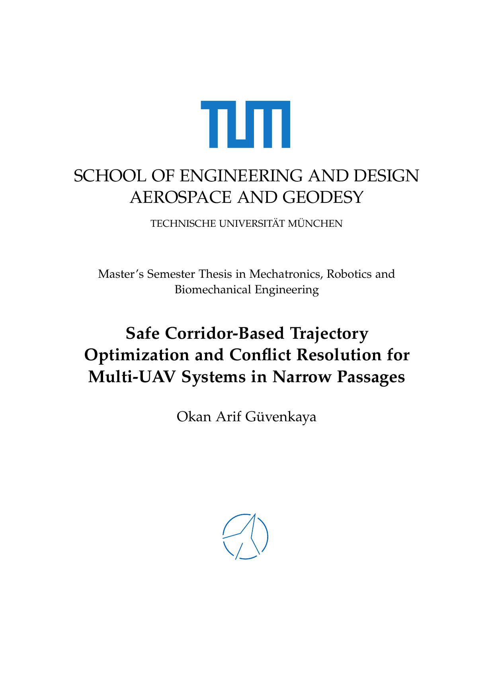
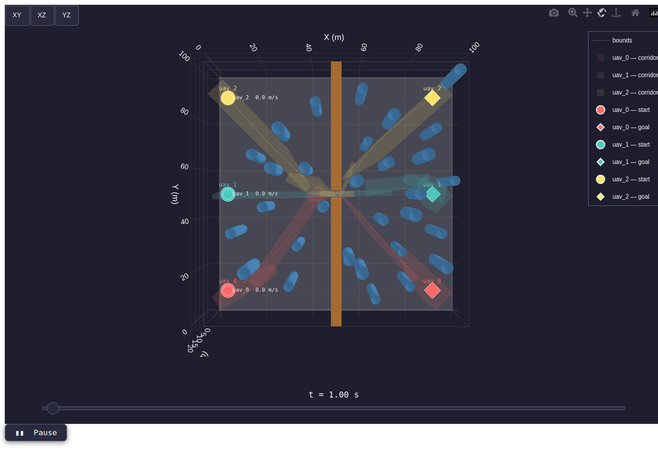
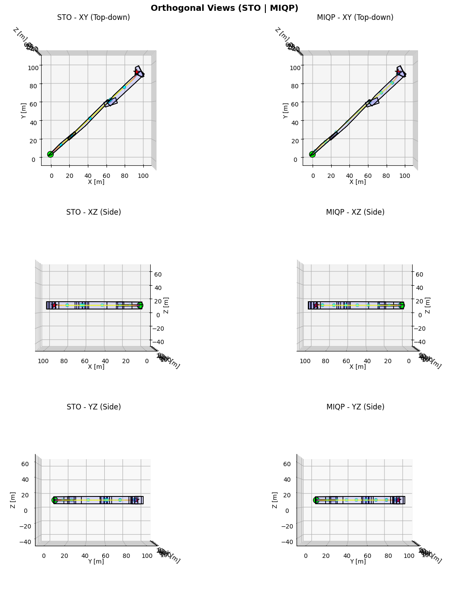
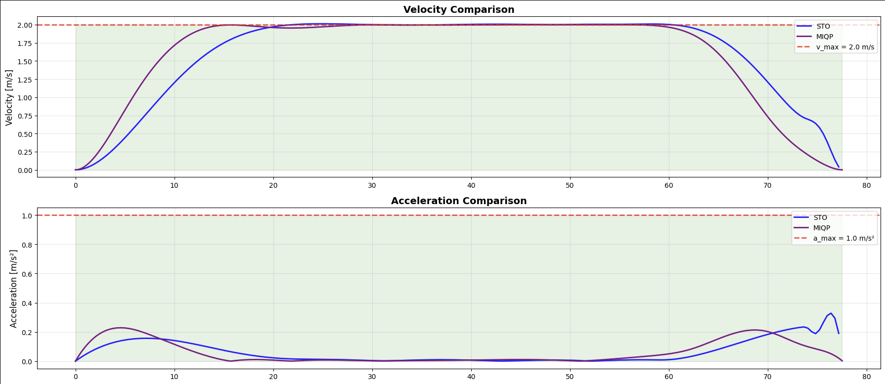
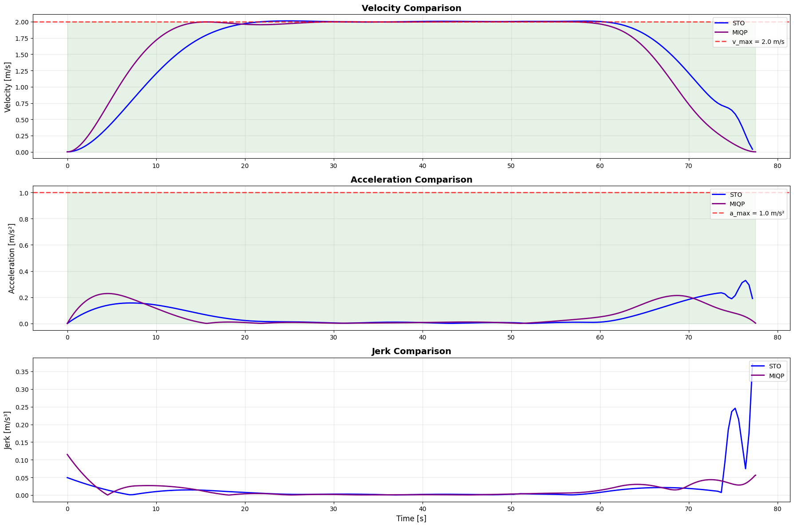

# UAV Safe Planning — Semester Thesis

<div align="center">

**Technical University of Munich (TUM)**  
Autonomous Aerial Systems Lab · Chair of Information-oriented Control (ITR)

[](https://www.python.org/)
[](https://pytorch.org/)
[](https://plotly.com/)

</div>

---

## Thesis

<div align="center">
  <a href="docs/Semester_Thesis.pdf">
    
  </a>
  <br/>
  <sub>📄 Click the cover to open the full thesis PDF</sub>
</div>

---

## Modules

| Module | Description |
|---|---|
| **STO** (Spatio-Temporal Optimizer) | Gradient-based single-UAV trajectory optimizer using MINCO (5th-order polynomial) representation and L-BFGS |
| **MIQP** (Mixed-Integer Quadratic Program) | Exact convex corridor-constrained trajectory planner using MINCO; used as a benchmark reference against STO |
| **Swarm Planner** | Multi-UAV pipeline: A\* global planning → convex safe corridor generation → STO optimization → space-time conflict detection & replanning |

---

## UAV Swarm Trajectory Generation Without Collision Optimization

<div align="center">

</div>

## After Collision Resolve

<div align="center">

</div>

---

## Results — STO vs. MIQP Comparison

<div align="center">

</div>

<div align="center">


</div>

---

## Repository Structure

```
uavsafeplanning/
├── STO/
│   ├── STO.ipynb                          # Single-UAV STO demo & benchmarks
│   ├── sto_planner.py                     # Core STO optimizer (L-BFGS + MINCO)
│   ├── sto_visualizer.py
│   └── utils.py
│
├── MIQP/
│   ├── MIQP.ipynb                         # MIQP demo & benchmark notebook
│   ├── miqp_planner.py                    # MIQP trajectory planner (CVXPY)
│   ├── MIQP_MINCO_solver.py               # MINCO-based MIQP solver
│   └── miqp_visualizer.py
│
├── STO_Cost_Comparison/
│   ├── STO_Cost_Comparison.ipynb          # L1 / L2 / log cost function comparison
│   ├── sto_cost_comparison_planner.py
│   ├── cost_comparison_utils.py
│   └── sto_cost_comparison_visualizer.py
│
├── STO_MIQP_Comparison/
│   └── STO_VS_MIQP_Comparison.ipynb       # Head-to-head STO vs. MIQP analysis
│
├── SWARM/
│   ├── SwarmPlanning.ipynb                # Full swarm planning demo notebook
│   ├── SingleUAV.ipynb                    # Single UAV within swarm context
│   ├── environment.py                     # 3-D voxel environment (cylinders + walls)
│   ├── global_planner.py                  # A* path planner (6 / 18 / 26-connectivity)
│   ├── safe_corridor.py                   # Convex safe corridor generation
│   ├── conflict_detector.py               # Space-time conflict detection (proximity + LP)
│   ├── conflict_resolver.py               # Temporal-delay conflict resolution + replanning
│   ├── trajectory_generator.py
│   ├── visualizer_simulation.py           # 3-D Plotly animation renderer
│   ├── visualizer_static.py
│   ├── uav.py
│   └── configs/                           # YAML configs (environment, planner, fleet)
│
├── STO_Swarm/                             # STO adapted for swarm replanning
│   ├── sto_swarm_planner.py
│   ├── sto_swarm_utils.py
│   └── sto_swarm_visualizer.py
│
├── traj_gen_utils/
│   └── minco.py                           # MINCO trajectory representation
│
└── figures/                               # Result figures
```

---

## Method

### 1 · Single-UAV Trajectory Optimization (STO)

The STO planner represents trajectories as piecewise 5th-order polynomials using the
**MINCO** parameterization. Optimization minimizes jerk energy subject to soft
constraints on velocity, acceleration, and convex safe corridors:

$$\min_{c, T} \; \lambda_{\text{jerk}} \, J_{\text{jerk}} + \lambda_T \, J_T + \lambda_v \, P_v + \lambda_a \, P_a + \lambda_c \, P_{\text{corridor}}$$

L-BFGS with an optional adaptive weight escalation scheme drives fast convergence.
Corridor penalties support L1, L2, and log-barrier formulations.

### 2 · MIQP Baseline

The MIQP planner solves the same corridor-constrained trajectory problem as a
**Mixed-Integer Quadratic Program** using CVXPY, providing an exact (optimal within
the convex relaxation) benchmark. MINCO polynomial coefficients are directly
optimized subject to hard corridor and dynamics constraints.

### 3 · Multi-UAV Swarm Planner

The full pipeline for each planning cycle:

```
For each UAV:
  1. A*  →  global waypoint path (26-connectivity, LOS pruning)
  2. Safe corridor generation  →  convex polytope chain {Aₖx ≤ bₖ}
  3. STO optimization          →  smooth, dynamically-feasible trajectory

Iterative conflict resolution:
  while conflicts detected (max rounds):
    detect  →  identify conflicting UAV pair & violation interval
    resolve →  inject temporal delay to loser; replan with STO
```

### 4 · Conflict Detection

Two complementary checks on every ordered pair of UAVs:
- **Proximity check**: linear interpolation onto a common time grid; contiguous windows
  below safety distance `r_i + r_j + margin` are flagged.
- **Corridor intersection (LP)**: spatial polytope overlaps plus temporal window
  intersection yield structural conflict zones.

---

## Quick Start

```bash
git clone git@github.com:okanarif/CopySemesterThesis.git
cd CopySemesterThesis/uavsafeplanning
python -m venv venv && source venv/bin/activate
pip install torch numpy scipy cvxpy plotly pyyaml jupyter

# Full swarm demo
jupyter notebook uavsafeplanning/SWARM/SwarmPlanning.ipynb

# STO vs. MIQP comparison
jupyter notebook uavsafeplanning/STO_MIQP_Comparison/STO_VS_MIQP_Comparison.ipynb
```

---

## Configuration

| File | Controls |
|---|---|
| `SWARM/configs/environment.yaml` | World bounds, obstacles (cylinders / walls), fleet (start, goal, v\_max, a\_max) |
| `SWARM/configs/planner.yaml` | A\* connectivity & clearance, safe corridor seed box, STO weights & iterations, conflict detection margins, replanning budget |

---

## Acknowledgements

This work was carried out at the **Autonomous Aerial Systems Lab**,
Chair of Information-oriented Control (ITR), Technical University of Munich (TUM).

I would like to sincerely thank:

- **[Prof. Dr. Markus Ryll](https://www.ce.cit.tum.de/itr/people/ryll/)** — for supervising this thesis and for his
  invaluable scientific guidance throughout the project.
- **Lukas Pries** (PhD Candidate, Autonomous Aerial Systems Lab, TUM) — for his
  day-to-day mentorship, technical advice, thoughtful discussions, and continuous
  support at every stage of this work.

---

## License

This repository is made available for academic and research purposes.  
© 2026 Okan Arif · Technical University of Munich
